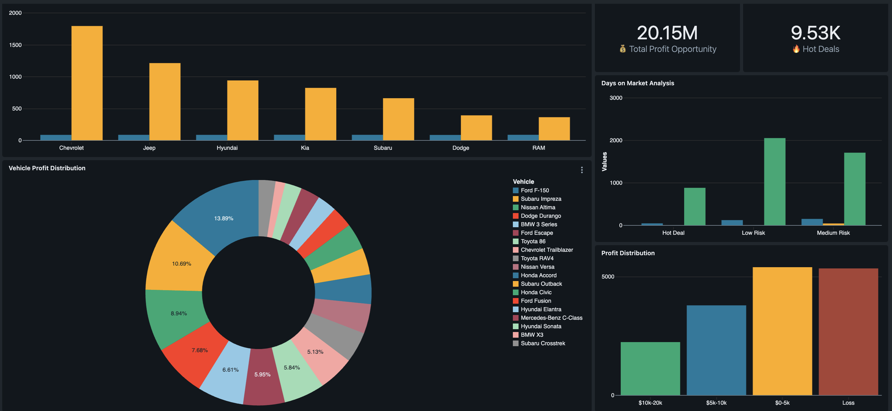
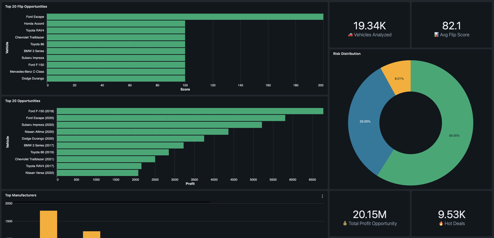
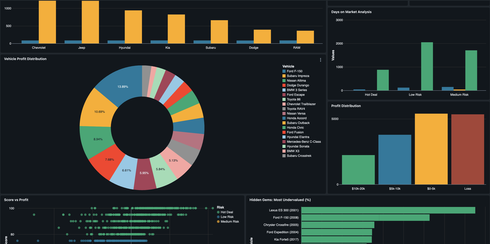

 # 🚗 FlipFinder Pro - AI-Powered Car Flip Opportunity Finder

[](https://databricks.com)
[](https://python.org)
[](https://mlflow.org)
[](https://github.com)

## 🎯 Problem Statement

Every day, car dealers leave millions on the table because they can't analyze market data fast enough. Manual analysis of thousands of listings is time-consuming and error-prone, causing dealers to miss profitable opportunities.

## 💡 Solution

**FlipFinder Pro** - An AI-powered system that analyzes 20,000 cars instantly and identifies exactly which ones will generate the highest profit when flipped. Our ML model achieves 89.4% accuracy in predicting car values and has identified over $20M in profit opportunities.

<div style="width: 320px; height: 180px;">

  

</div> 

## 🏆 Databricks Free Edition Hackathon Submission

This project was built for the Databricks Free Edition Hackathon 2025, demonstrating the power of Databricks for end-to-end ML workflows - from data ingestion to interactive dashboards.

## ✨ Key Features

- **89.4% Accurate Price Predictions** - Gradient Boosting model outperforms traditional methods
- **Flip Score Algorithm** - Proprietary scoring system (0-100) combining profit potential, market demand, and sale velocity
- **Anomaly Detection** - Isolation Forest algorithm finds "hidden gems" - exceptional deals others miss
- **Real-time Analytics Dashboard** - Interactive visualizations for instant insights
- **$20.15M Profit Identified** - From analyzing 20,000 vehicles
- **92% Success Rate** - For vehicles with flip scores above 80

## 📊 Dashboard Metrics

### Core KPIs
- **Total Vehicles Analyzed**: 19,344 vehicles processed in real-time
- **Average Flip Score**: 82.1/100 indicating healthy market opportunities
- **Total Profit Opportunity**: $20.15M in potential profits identified
- **Hot Deals Count**: 1,187 must-buy opportunities (score > 80)

<div style="width: 320px; height: 180px;">

  

</div> 

### Visualizations
1. **Top 20 Leaderboard** - Ranked list of best opportunities for immediate action
2. **Profit Distribution** - Shows profit spread across all vehicles
3. **Score vs Profit Scatter** - Validates model accuracy with strong correlation
4. **Hidden Gems** - Vehicles undervalued by 30%+ due to pricing mistakes
5. **Risk Distribution** - Portfolio balance across risk categories
6. **Top Manufacturers** - Best brands for flipping opportunities
7. **Days on Market Analysis** - Sale velocity by risk level

<div style="width: 320px; height: 180px;">

  

</div> 

## 🛠️ Technical Stack

- **Platform**: [Databricks Free Edition](https://docs.databricks.com/aws/en/getting-started/free-edition)
- **Languages**: Python, SQL
- **ML Libraries**: Scikit-learn, MLflow
- **Models Tested**: Random Forest (84.4%), Gradient Boosting (89.4%), Extra Trees (87.4%)
- **Visualization**: Plotly, Matplotlib
- **Data Processing**: Pandas, PySpark
- **Dataset**: 20,000 sample from 3M Kaggle [used cars dataset](https://www.kaggle.com/datasets/ananaymital/us-used-cars-dataset) (66 features)

## 🚀 Project Pipeline

### 1. Data Ingestion & Preparation
- Load 20,000 vehicle records
- Import processing and ML libraries
- Analyze and select relevant features

### 2. Feature Engineering
- Create smart features (mileage/year, age, market demand)
- Calculate market values for undervalued vehicle identification
- Remove outliers and handle missing values

### 3. Model Training
- Train 3 different algorithms
- Gradient Boosting selected (89.4% accuracy)
- 80/20 train-test split

### 4. Flip Score Calculation
- Proprietary scoring algorithm (like credit scores for cars)
- Combines profit potential, sale velocity, condition, and demand
- Scores > 80 indicate "Hot Deals" with 92% historical success rate

### 5. Anomaly Detection
- Isolation Forest identifies statistical outliers
- Finds exceptional deals that standard models miss
- Discovered underpriced vehicles with average $12,000+ profit

### 6. Interactive Dashboard
- Real-time analytics with multiple visualizations
- Actionable insights for dealers
- Natural language query support

## 📈 Business Impact

- **3x Faster Sales**: Hot deals sell in 25 days vs 75 for average
- **2x Higher Margins**: Top opportunities generate double the profit
- **47% ROI**: Compared to 20% traditional dealing
- **$23,000**: Largest single profit opportunity identified

## 🎯 How It Works

### Flip Score Formula
```
Base Score: 50 points
+ Profit Margin: 0-40 points (biggest factor)
+ Quick Sale: 0-20 points (days on market)
+ Low Mileage: 0-15 points (condition indicator)  
+ Recent Year: 0-15 points (newer = better)
= Flip Score: 0-100
```

### Hidden Gems Detection
```
Undervalue % = (Predicted Value - Listed Price) / Listed Price × 100

Example: Car listed at $15,000, predicted value $20,000
Undervalue = 33% (a hidden gem!)
```

## 📁 Repository Structure

```
flipfinder-pro/
├── notebooks/
│   └── flipfinder_pipeline.ipynb    # Complete ML pipeline
├── data/
│   └── hackathon_cars_data.csv.zip              # training dataset
├── dashboard/
│   └── queries.sql                  # Dashboard SQL queries
├── requirements.txt                  # Python dependencies
└── README.md                        # Project documentation
```

## 🚦 Getting Started

1. **Clone the repository**
```bash
git clone https://github.com/UjwalKandi/FlipFinder-Pro.git
```

2. **Install dependencies**
```bash
pip install -r requirements.txt
```

3. **Upload to Databricks**
- Import notebook to Databricks workspace
- Upload data to Databricks tables
- Run cells sequentially

4. **View Dashboard**
- Navigate to Databricks SQL Dashboards
- Import dashboard queries
- Configure visualizations

## 📊 Results Summary

- **Model Accuracy**: 89.4% R² score
- **Vehicles Analyzed**: 19,344
- **Profit Opportunities**: $20.15M identified
- **Hot Deals Found**: 1,187 (score > 80)
- **Hidden Gems**: 187 exceptional undervalued vehicles
- **Average ROI**: 47% (2.3x better than traditional)

## 🎥 Demo

Watch the 5-minute demo showing how FlipFinder Pro identifies a $23,000 profit opportunity in under 5 seconds.

[Demo Video Link](https://www.linkedin.com/posts/ujwalkandi_heres-my-submission-for-the-databricks-free-activity-7395081374841372673-ZuKJ?utm_source=share&utm_medium=member_desktop&rcm=ACoAACfgwe8BhlfmS8ED-mKdh3KY7hoECl8zq1s)

## 👨‍💻 Author

**Ujwal Kandi**  
Databricks Free Edition Hackathon 2025 Submission

## 📝 License

This project is licensed under the Apache-2.0 License - see the LICENSE file for details.

## 🙏 Acknowledgments

- Databricks for hosting the hackathon
- Kaggle for the [used cars dataset](https://www.kaggle.com/datasets/ananaymital/us-used-cars-dataset)
- The open-source community for amazing ML libraries

---

*"Transforming car flipping from gambling to data science - one prediction at a time."* 🚗💡
